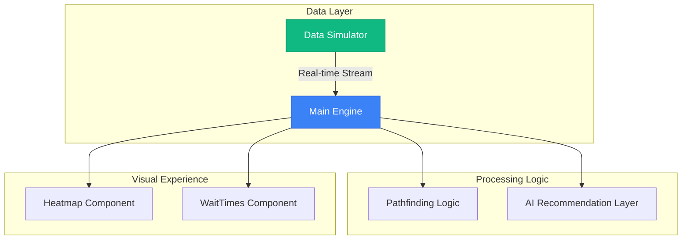

# 🏟️ CrowdSense AI

### **Intelligent Stadium Management & Crowd Orchestration System**


<div align="center">

[](https://github.com/sirshivansh/crowdsense-ai)
[](https://vitejs.dev/)
[](https://crowdsense.ai)
[](https://opensource.org/licenses/MIT)

[**🌐 Live Demo**](https://crowdsense-ai-166892294330.asia-south1.run.app) | [**📖 Documentation**](#-architecture) | [**🛠️ Setup Guide**](#-local-development)

</div>

---

## 🌟 Overview

**CrowdSense AI** is a high-fidelity, real-time stadium management platform that transforms raw attendee data into actionable intelligence. Designed for high-capacity venues, it leverages a sophisticated data-driven engine to optimize fan flow, minimize wait times, and maximize operational efficiency.

> [!NOTE]
> Large-scale venues often struggle with "opaque congestion"—data that exists but isn't actionable. CrowdSense AI bridges this gap with a living, breathing digital twin of the stadium environment.

---

## ✨ Key Features

### 🏛️ Live Venue Mapping
*   **Adaptive Heatmaps**: Real-time visualization of crowd density across gates, sections, and food courts.
*   **Living Zones**: Animated flow indicators showing exact crowd movement patterns.
*   **Interactive Tooltips**: Instant metrics on zone capacity, wait times, and status.

### 🧠 AI Intelligence Layer
*   **Best Action Engine**: Dynamically calculates optimal routes based on real-time sensor data.
*   **Smart Suggestions**: AI-driven alerts for potential bottle-necks before they happen.
*   **Predictive Analytics**: Forecasts congestion trends based on historical data and live inputs.

### 🗺️ Smart Routing & Navigation
*   **Congestion-Aware Pathfinding**: Guides fans through the least crowded routes.
*   **Animated Navigation**: Visual pathfinding to gates and facilities.
*   **Accurate ETA Calculation**: Real-time estimates based on current crowd velocity.

---

## 📸 UI Previews

<carousel>
<!-- slide -->
### 🖥️ Admin Control Center

*Real-time monitoring and high-level KPI oversight.*

<!-- slide -->
### 📱 Fan Experience

*Smooth, congestion-aware pathfinding for every attendee.*
</carousel>

---

## ⚙️ Tech Stack

| Layer | Technologies |
| :--- | :--- |
| **Frontend** | Vanilla JavaScript (ES Modules), Vite |
| **Styling** | Custom CSS (Glassmorphism, CSS Variables) |
| **Deployment** | Google Cloud Run ☁️ |
| **Infrastructure**| Docker, Cloud Build |
| **Intelligence** | Custom Pathfinding & Congestion Algorithms |

---

## 🏗️ Architecture

The system is built on a modular "Engine-First" architecture, ensuring low latency and high scalability.



---

## 🛠️ Local Development

Ready to build the future of stadium management?

### 1. Installation

```bash
# Clone the repository
git clone https://github.com/sirshivansh/crowdsense-ai.git

# Enter the directory
cd crowdsense-ai

# Install dependencies
npm install
```

### 2. Available Commands

| Command | Action |
| :--- | :--- |
| `npm run dev` | Spins up the local development server |
| `npm run build` | Compiles the project for production |
| `npm run preview` | Previews the production build locally |

---

## ☁️ Deployment

CrowdSense AI is containerized and optimized for **Google Cloud Run**.

```bash
gcloud run deploy crowdsense-ai \
  --source . \
  --region asia-south1 \
  --allow-unauthenticated
```

---

## ⚡ Performance

*   🚀 **Zero Framework Overhead**: Built with lightweight Vanilla JS.
*   🧠 **Efficient DOM Updates**: Hand-optimized rendering engine.
*   🎯 **Fast Load Times**: Minimized asset footprint with Vite.

---

## 👨‍💻 Author

**Shivansh Mishra**
*Elevating the Stadium Experience with AI 🚀*

---

## 🛡️ License

This project is licensed under the **MIT License**. See the `LICENSE` file for details.

