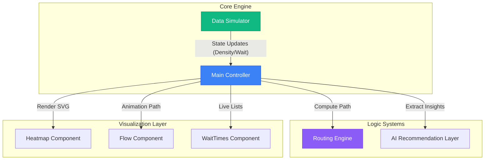

# 🏟️ CrowdSense AI

### **Intelligent Stadium Management & Crowd Orchestration System**

CrowdSense AI is a performance-optimized, high-fidelity stadium management platform. It transforms raw sensor data into actionable crowd intelligence, leveraging a data-driven engine to optimize fan flow, minimize wait times, and maximize operational safety.

---

## 🚀 Technical Highlights

- **Pure Performance**: Built with zero-framework Vanilla JavaScript (ES Modules) for near-instant execution and minimal bundle size.
- **Dynamic Pathfinding**: Implements a weighted Dijkstra algorithm that considers both distance and real-time crowd density ("congestion penalty") to find truly optimal routes.
- **Event-Driven Simulation**: Features a centralized `DataSimulator` using the Observer pattern to synchronize state across the heatmap, routing, and UI components.
- **Premium UI/UX**: Custom-crafted glassmorphism design system using CSS variables, ensuring a state-of-the-art visual experience without the bloat of external UI libraries.

---

## 🏗️ System Architecture

The project follows a modular, component-based architecture where each system manages its own lifecycle while remaining synchronized via a core simulator.



---

## 🧠 Software Components

### 1. **Routing Engine (`Routing.js`)**
The navigation system uses a NavMesh-style approach with predefined nodes and edges.
- **Congestion Weighting**: Unlike standard pathfinding, the edge weights are dynamically recalculated: `Weight = Distance + (Density * Sensitivity)`.
- **Animated SVG Paths**: Paths are rendered using SMIL-style animations or CSS transitions on `stroke-dashoffset` for a smooth "drawing" effect.

### 2. **Adaptive Heatmap (`Heatmap.js`)**
- **Dynamic CSS Filtering**: Uses CSS variables and `fill-opacity` transitions to represent density without re-rendering the entire SVG.
- **Context-Aware Tooltips**: Instant DOM injection provides point-of-interest data (density, wait time predictions) on hover.

### 3. **AI Recommendation Layer**
- **Optimal Zone Selection**: Automatically identifies the least congested entry/exit points and calculates time-saving metrics for the user.
- **Predictive Toasts**: Listens for threshold alerts from the simulator to trigger proactive warnings (e.g., "High congestion at Section 205").

---

## ⚙️ Tech Stack & Tooling

| Layer | Technology | Rationale |
| :--- | :--- | :--- |
| **Bundler** | Vite 5.x | HMR and lightning-fast production builds. |
| **Language** | Vanilla JavaScript (ES6+) | Maximum control and zero runtime overhead. |
| **Styling** | Vanilla CSS (Variables) | Highly performant design tokens and animations. |
| **Icons** | Emojis & SVG | Resolution-independent and dependency-free. |
| **Deployment**| Google Cloud Run | Scalable, containerized infrastructure. |

---

## 🛠️ Local Development

### Prerequisites
- Node.js 18+
- npm 9+

### Setup
```bash
# 1. Clone the repository
git clone https://github.com/sirshivansh/crowdsense-ai.git

# 2. Install dependencies
npm install

# 3. Start development server
npm run dev
```

### Available Scripts
- `npm run dev`: Start Vite development server.
- `npm run build`: Generate production-ready assets in `/dist`.
- `npm run preview`: Locally preview the production build.

---

## ☁️ Deployment

CrowdSense AI is optimized for containerized deployment on **Google Cloud Run**.

```bash
gcloud run deploy crowdsense-ai \
  --source . \
  --region asia-south1 \
  --allow-unauthenticated
```

---

## 👨‍💻 Author

**Shivansh Mishra**  
*Building the future of smart stadium orchestration.*

---

## 🛡️ License

This project is licensed under the **MIT License**.
